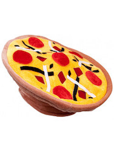

Your good friend Millie just opened a pizza restaurant: Pizza Express!! However, the developer they hired to build the site left it unfinished. Right now it has the beginning of a server and a front-end, but there's no database attached yet. Oh no!

Your task is to build out the database, the models, and the controllers. Good luck, Developer!

### Setup

- Create a database `pizza_dresselhaus_dev`. You **must** name the database this. Run the migration and seed files.
- Run `npm install` within `dresselhaus-pizza-express` directory to install all the dependencies. (Note: The app will not work at this point. Your job is to get it working.)
- Fill out:
* `db/config.js`,
* `models/pizza.js`,
* `controllers/pizza-controller.js`.

## 🚀 Completion looks like:

- You have a complete
  * `db/config.js`,
  * `models/pizza.js`,
  * `controllers/pizza-controller.js`.
- Your `server.js` and `routes/pizza-routes` files have been commented on EVERY line.
- Your `errors.md` has its errors filled in.

